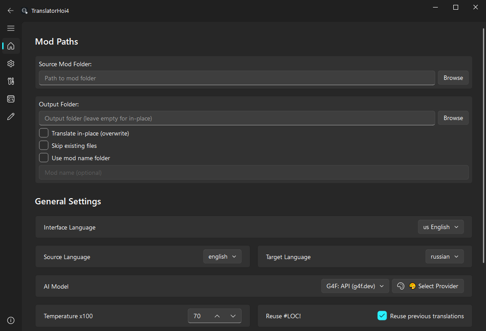

<div align="center">

# 🎮 TranslatorHoi4

**AI-Powered Localization Translator for Paradox Games**

[](https://github.com/Locon213/TranslatorHoi4/actions/workflows/build.yml)
[](https://github.com/Locon213/TranslatorHoi4/releases/latest)
[](https://github.com/Locon213/TranslatorHoi4/releases)
[](https://github.com/Locon213/TranslatorHoi4/blob/main/LICENSE)
[](https://www.python.org/downloads/)

[](https://github.com/Locon213/TranslatorHoi4/releases)
[](https://github.com/Locon213/TranslatorHoi4/releases)
[](https://github.com/Locon213/TranslatorHoi4/releases)

</div>

---

<div align="center">



</div>

---

## ✨ Features

<table>
<tr>
<td width="50%">

### 🎯 Game Support
- **Hearts of Iron IV** — fully optimized
- **Crusader Kings III**
- **Europa Universalis IV**
- **Stellaris**
- **Victoria 3**
- **Imperator: Rome**
- **Custom mod themes** — My Little Pony, Cold War, Fantasy, etc.
- Works with any Paradox game using YAML localization

</td>
<td width="50%">

### 🤖 AI Providers
- **OpenAI** (GPT-5.4)
- **Anthropic** (Claude family)
- **Google** (Gemini 3 Pro/Flash)
- **NVIDIA NIM** — free & fast ⭐
- **Groq, Together.ai, Mistral**
- **DeepL, Ollama (local), G4F**

</td>
</tr>
<tr>
<td width="50%">

### 🌐 Cross-Platform
- **Windows** — x64, ARM64
- **Linux** — x64, ARM64, Deb, RPM
- **macOS** — Intel, Apple Silicon
- Native performance with Nuitka compilation

</td>
<td width="50%">

### 🛠️ Built for Modders
- Modern Fluent Design UI
- **Game-specific translation profiles** — optimized prompts for each Paradox game
- **Custom mod theme support** — tell AI your mod's theme for better vocabulary
- Glossary support for consistent translations
- Batch translation with caching
- Built-in file review & editing
- Syntax validation for Paradox format

</td>
</tr>
</table>

---

## 📥 Installation

### Windows

| Method | Instructions |
|--------|-------------|
| **💾 Installer (Recommended)** | Download `TranslatorHoi4_Setup_*.exe` → Run → Launch from Start Menu |
| **📦 Portable** | Download `TranslatorHoi4_Windows_*.zip` → Extract → Run `.exe` |

### Linux

| Method | Command |
|--------|---------|
| **📦 DEB** (Debian/Ubuntu) | `sudo dpkg -i translatorhoi4_*.deb && sudo apt-get install -f` |
| **📦 RPM** (Fedora/openSUSE) | `sudo rpm -i translatorhoi4-*.rpm` |
| **📦 Portable** | `tar -xzf TranslatorHoi4_Linux_*.tar.gz && ./TranslatorHoi4/TranslatorHoi4` |

**Dependencies** (if not using packages):
```bash
# Debian/Ubuntu
sudo apt-get install libegl1 libopengl0 libgl1 libxkbcommon-x11-0 \
  libxcb-cursor0 libxcb-icccm4 libxcb-image0 libdbus-1-3 libpulse0

# Fedora
sudo dnf install libglvnd-glx libxkbcommon libXcursor libdbus-1 pulseaudio-libs
```

### macOS

1. Download `TranslatorHoi4_macOS_*.dmg`
2. Open DMG file
3. Drag `TranslatorHoi4.app` to Applications
4. **First launch:** Right-click → Open (bypass Gatekeeper)

### 🧪 From Source

```bash
git clone https://github.com/Locon213/TranslatorHoi4.git
cd TranslatorHoi4
python -m venv .venv
source .venv/bin/activate  # Windows: .venv\Scripts\activate
pip install -r requirements.txt
python -m translatorhoi4
```

---

## 🧠 Improved AI Translation Prompts

TranslatorHoi4 now uses **game-specific translation profiles** to deliver higher quality localization:

### Supported Games

| Game | Genre | Key Terminology |
|------|-------|-----------------|
| **Hearts of Iron IV** | WW2 Grand Strategy | Military, political, historical |
| **Crusader Kings III** | Medieval Dynasty Simulator | Feudal, dynastic, religious |
| **Europa Universalis IV** | Early Modern Strategy | Colonial, diplomatic, trade |
| **Stellaris** | Sci-Fi Grand Strategy | Space exploration, futuristic |
| **Victoria 3** | Industrial Era Strategy | Economic, social, industrial |
| **Imperator: Rome** | Ancient Strategy | Classical, Hellenistic, Roman |

### Custom Mod Themes

Translating a **My Little Pony** mod for HoI4? A **Cold War Modern** total conversion? No problem!

Just enter your mod's theme in the **Mod Theme** field and AI will adapt its vocabulary accordingly:

```
Game: Hearts of Iron IV
Mod Theme: My Little Pony, Friendship is Magic
```

AI will use appropriate MLP terminology while preserving game mechanics tokens like `$VARS$` and `[macros]`.

### What's New in Prompts

- ✅ **8 critical rules** instead of 2 — better protection against AI hallucinations
- ✅ **Game-specific terminology** — military terms for HoI4, medieval for CK3, sci-fi for Stellaris
- ✅ **Token preservation** — `$VARS$`, `[Scripted.Macros]`, `\n` kept intact
- ✅ **Context-aware translation** — AI understands the game's genre, style, and period
- ✅ **Mod theme override** — custom themes override default game vocabulary when needed

---

## 🤖 Recommended: NVIDIA NIM

<div align="center">

| Feature | Benefit |
|---------|---------|
| 💰 **Completely Free** | No paid tiers, no credit card required |
| ⚡ **Ultra Fast** | Optimized inference infrastructure |
| 🏆 **Quality Models** | Llama 4, Mixtral, and more |
| 🔒 **Official API** | Stable, reliable, enterprise-grade |

</div>

**Setup in 60 seconds:**
1. Go to [build.nvidia.com](https://build.nvidia.com/)
2. Sign in with NVIDIA account
3. Generate API key
4. Paste key in TranslatorHoi4 settings → Start translating!

---

## 🚀 Quick Start

1. **Launch** TranslatorHoi4
2. **Configure** AI provider in Settings (⚙️)
3. **Select** source mod folder
4. **Choose** target language
5. **Translate!**

---

## 📊 All Supported Providers

<details>
<summary>Click to expand full provider list</summary>

| Provider | Best For | Free Tier | Speed |
|----------|----------|-----------|-------|
| **NVIDIA NIM** | Testing & development | ✅ Unlimited | ⚡⚡⚡ |
| **Groq** | Production translation | ✅ Generous | ⚡⚡⚡ |
| **Google Gemini** | General purpose | ✅ Limited | ⚡⚡ |
| **Mistral AI** | European languages | ✅ Limited | ⚡⚡ |
| **Together.ai** | Open-source models | ✅ Limited | ⚡⚡ |
| **OpenAI** | Premium quality | ❌ | ⚡⚡ |
| **Anthropic** | Complex context | ❌ | ⚡⚡ |
| **DeepL** | Professional quality | ❌ | ⚡⚡ |
| **Ollama** | Privacy-focused (local) | ✅ Unlimited | ⚡ |
| **G4F** | Community alternative | ✅ Unlimited | ⚡ |

</details>

---

## 🏗️ Project Structure

```
translatorhoi4/
├── translator/      # Translation engines & backends
├── parsers/         # Paradox file parsers
├── ui/              # Modern Fluent UI components
├── utils/           # Utilities & helpers
└── app.py           # Application entry point
```

---

## 🛠️ Building from Source

```bash
pip install -r requirements.txt
python build.py      # Output: dist/TranslatorHoi4/
```

---

## 📜 License

[](https://opensource.org/licenses/MIT)

---

<div align="center">

**Made with ❤️ for Paradox Modding Community**

[📥 Download Latest](https://github.com/Locon213/TranslatorHoi4/releases/latest) • [🐛 Report Issue](https://github.com/Locon213/TranslatorHoi4/issues) • [💬 Discussions](https://github.com/Locon213/TranslatorHoi4/discussions)

</div>
